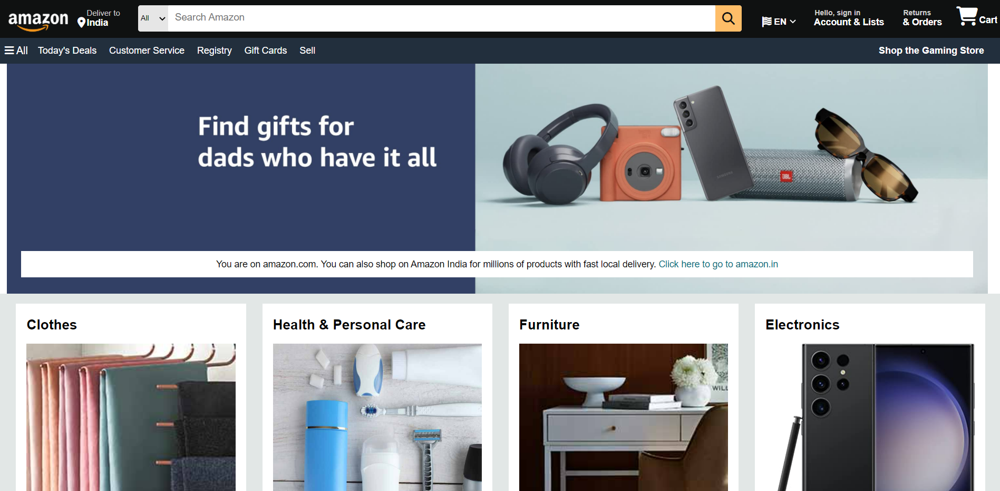
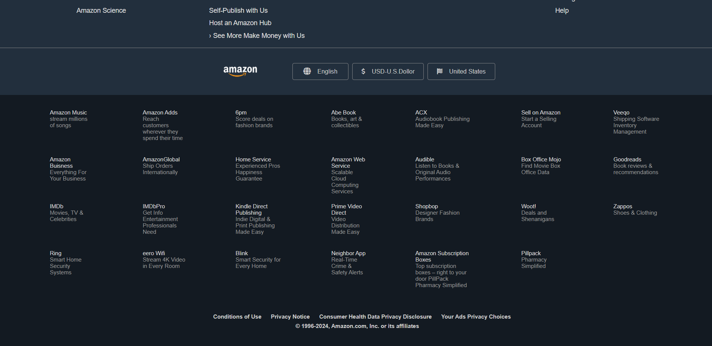

# Amazon Clone

This project is a frontend Amazon homepage clone built with HTML and CSS, with Django as the backend. It replicates the design and layout of the Amazon website, including a responsive header, search bar, product categories, and footer.

## Features

- **Responsive Header:**
  - Includes the Amazon logo, search bar, cart, and account links.
  - Hover effects for the border elements and interactive search button.
  
- **Product Sections:**
  - Displays various product categories (Clothes, Health & Personal Care, Electronics, etc.) with images and links.
  - Each product box has hover effects for links.
  
- **Footer:**
  - Contains multiple links to Amazon services.
  - Language, currency, and country selectors with styling.

- **CSS Styling:**
  - Font Awesome icons used for search, cart, and location.
  - Flexbox is used for layout and alignment across the navbar, product sections, and footer.

## Screenshots

Here are some screenshots of the Amazon Clone:

### 1. Homepage (Header, Search Bar, and Product Categories)


### 2. Footer Section


## Technologies Used

- **HTML5**: Structure and content of the webpage.
- **CSS3**: Styling the layout, responsiveness, and hover effects.
- **Font Awesome**: Icons for cart, search, and location.
- **Django**: Backend framework for handling server-side logic and database interactions.

## Installation and Setup

1. Clone the repository:

   ```bash
   git clone https://github.com/your-username/amazon-clone.git

## Admin panel Credential   
  to become Admin to manage database run python manage.py createsuperuser command in terminal and add your credential
  ### example
- **username**: admin.
- **password**: admin123.
- **email**:admin123@gmail.com
